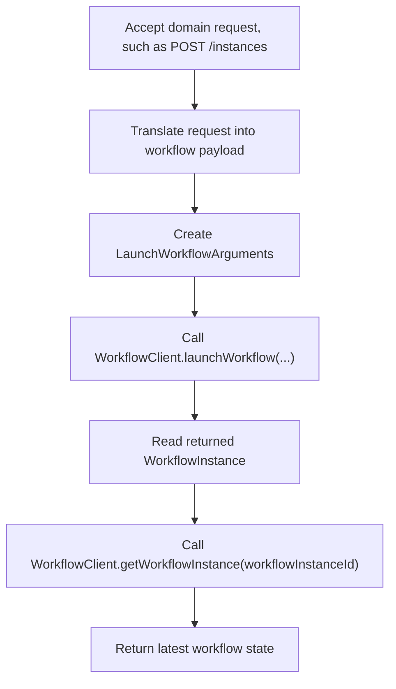

# Workflow

---

## Overview

The Workflow integration registers configured OCI Workflow-as-a-Service (WFaaS) clients with the
Helidon service registry. Applications can inject the default worker client or named worker and
poller clients, while configuration under `oci.workflow` controls endpoints, timeouts, retry
policy, and TLS settings.

---

## Maven Coordinates

To enable workflow support, add the following dependency to your project's `pom.xml`:

```xml
<dependency>
    <groupId>com.oracle.helidon.oci.workflow</groupId>
    <artifactId>helidon-oci-workflow</artifactId>
</dependency>
```

---

## Usage

### Inject Workflow services

You can inject `WorkflowClient` directly. By default, the injected client uses the worker role:

```java
@Service.Inject
ProvisioningWorkflowService(WorkflowClient workflowClient) {
    this.workflowClient = workflowClient;
}
```

You can also inject the named worker and poller clients explicitly:

```java
@Service.Inject
ProvisioningWorkflowService(@Service.Named(WorkflowClientModule.WORKFLOW_WORKER_CLIENT_NAME)
                            WorkflowClient workerClient,
                            @Service.Named(WorkflowClientModule.WORKFLOW_POLLER_CLIENT_NAME)
                            WorkflowClient pollerClient) {
    this.workerClient = workerClient;
    this.pollerClient = pollerClient;
}
```

Alternatively, you can access the default worker client through the service registry:

```java
WorkflowClient workflowClient = Services.get(WorkflowClient.class);
LaunchWorkflowArguments request = LaunchWorkflowArguments.builder()
        .workflowDefinitionId(WorkflowDefinitionId.builder()
                                     .name("instance-create")
                                     .majorVersion(3)
                                     .minorVersion(1)
                                     .build())
        .workflowArguments("{\"resourceId\":\"ocid1.instance.oc1..example\",\"operation\":\"CREATE\"}"
                                   .getBytes(StandardCharsets.UTF_8))
        .build();

WorkflowInstance workflowInstance = workflowClient.launchWorkflow(request);
```

To retrieve the poller client from the service registry, use:

```java
WorkflowClient pollerClient = Services.getNamed(WorkflowClient.class,
                                                WorkflowClientModule.WORKFLOW_POLLER_CLIENT_NAME);
```

---

## Example Application

The repository includes a runnable WFaaS example in `examples/workflow`.

The example provides:

* a small Helidon service that injects `WorkflowClient`
* a plain-text REST interface for launching a workflow and polling for status
* HTTP tests using a driver-style simulated workflow client
* an opt-in integration test path for a configured WFaaS environment

See the [Workflow example](../../examples/workflow/README.md) for build, run, and integration-test commands.

---

## Configuration

The `oci.workflow` configuration can be customized using YAML configuration.

WFaaS client properties:

| Config Key | Default Value | Description |
|------------|---------------|-------------|
| `domain-id` | `localhost` | Workflow domain identifier. |
| `endpoint-details.server-endpoint` | `http://localhost:39000` | WFaaS endpoint. |
| `endpoint-details.connect-timeout` | `PT30S` | Socket connect timeout. `endpoint-details.connection-timeout` is also accepted as an alias. |
| `endpoint-details.worker-read-timeout` | `PT30S` | Worker read timeout. |
| `endpoint-details.poller-read-timeout` | `PT30S` | Poller read timeout. |
| `worker-identifier` | Runtime MXBean name | Optional override for the worker identity. |
| `dynamic-ssl-context-provider-name` | | Optional name of a reusable dynamic SSL context provider. |
| `retry-policy.max-retry-count` | | Optional WFaaS retry policy max retry count. |
| `retry-policy.delay-between-retry` | | Optional WFaaS retry delay. Use a `Duration` value such as `PT0.25S`. |
| `retry-policy.jitter-factor` | | Optional WFaaS retry jitter factor. |

Aliases are provided for user convenience, either to align with native OCI parameter names or with similar settings
in other Helidon OCI modules. Specify at most one name for an aliased setting, not both.

Workflow can use a reusable dynamic SSL context provider configured under `oci.dynamic-ssl-context-providers`.
Those entries are exposed as named `DynamicSslContextProviderConfig` services. Applications can also provide their own
named `DynamicSslContextProviderConfig` service. Set `oci.workflow.dynamic-ssl-context-provider-name` to select the
provider. If that property is omitted and a provider named `workflow` exists, Workflow uses it by convention. For
compatibility with earlier releases, optional dynamic SSL context settings can still be provided under
`oci.dynamic-ssl-context-provider`, including `root-cert-path`.

Example configuration in `application.yaml`:

```yaml
oci:
  dynamic-ssl-context-providers:
    - name: workflow
      leaf-cert-path: /etc/oci-pki/workflow-leaf.pem
      leaf-cert-key-path: /etc/oci-pki/workflow-leaf.key
      leaf-cert-key-passphrase: changeit
      intermediate-cert-path: /etc/oci-pki/workflow-intermediate.pem
      root-cert-path: /etc/pki/ca-trust/extracted/pem/tls-ca-bundle.pem
      duration: PT15M
  workflow:
    domain-id: compute-control-plane
    dynamic-ssl-context-provider-name: workflow
    endpoint-details:
      server-endpoint: https://wfaas-overlay.${oci.env.ad-number}.${oci.env.iaas-domain-name}
      connect-timeout: PT5S
      worker-read-timeout: PT30S
      poller-read-timeout: PT90S
    worker-identifier: my-service-workflow-client
    retry-policy:
      max-retry-count: 7
      delay-between-retry: PT0.25S
      jitter-factor: 0.5
```

The endpoint example above matches the pattern documented in
[Environment Configuration](../utilities/environment-config.md).

---

## Upgrade

If you are upgrading from the Helidon OCI 1.3 `workflow-java-client` module, most WFaaS client
configuration can be carried forward with only a few changes.

What you can keep:

* `oci.workflow.domain-id`
* `oci.workflow.endpoint-details.server-endpoint`
* `oci.dynamic-ssl-context-provider.*`
* `@Service.Named(WorkflowClientModule.WORKFLOW_WORKER_CLIENT_NAME)` worker injection
* `@Service.Named(WorkflowClientModule.WORKFLOW_POLLER_CLIENT_NAME)` poller injection

What is intentionally different:

* Endpoint timeout properties now use `Duration` values and were renamed from
  `connect-timeout-millis`, `worker-read-timeout-millis`, and `poller-read-timeout-millis`
  to `connect-timeout`, `worker-read-timeout`, and `poller-read-timeout`.
* Retry policy delay now uses a `Duration` value through `retry-policy.delay-between-retry`.
* `worker-identifier` can now be configured explicitly. If you do not set it, the previous runtime-default behavior is preserved.
* `retry-policy.*` can now be configured explicitly if you need to override the WFaaS retry behavior.

Example upgrade:

Helidon OCI 1.3 style configuration:

```yaml
oci:
  workflow:
    domain-id: compute-control-plane
    endpoint-details:
      server-endpoint: https://wfaas-overlay.${oci.env.ad-number}.${oci.env.iaas-domain-name}
      connect-timeout-millis: 5000
      worker-read-timeout-millis: 30000
      poller-read-timeout-millis: 90000
  dynamic-ssl-context-provider:
    root-cert-path: /etc/pki/ca-trust/extracted/pem/tls-ca-bundle.pem
```

Updated configuration:

```yaml
oci:
  workflow:
    domain-id: compute-control-plane
    endpoint-details:
      server-endpoint: https://wfaas-overlay.${oci.env.ad-number}.${oci.env.iaas-domain-name}
      connect-timeout: PT5S
      worker-read-timeout: PT30S
      poller-read-timeout: PT90S
    worker-identifier: my-service-workflow-client
    retry-policy:
      max-retry-count: 7
      delay-between-retry: PT0.25S
      jitter-factor: 0.5
  dynamic-ssl-context-provider:
    root-cert-path: /etc/pki/ca-trust/extracted/pem/tls-ca-bundle.pem
```

If your application only used the old worker and poller clients directly, the main upgrade work is to
rename the timeout properties to the new `Duration` form and, if needed, update retry delay to the new
`Duration` property. The additional properties are only needed if you want a custom `worker-identifier` or
want to override retry behavior.

---

## Main Flow

An application integrating WFaaS typically follows this flow:



Example service code:

```java
@Service.Singleton
class ProvisioningWorkflowService {
    private final WorkflowClient workflowClient;

    @Service.Inject
    ProvisioningWorkflowService(WorkflowClient workflowClient) {
        this.workflowClient = workflowClient;
    }

    String launch(CreateInstanceRequest request) {
        LaunchWorkflowArguments launchRequest = LaunchWorkflowArguments.builder()
                .workflowDefinitionId(WorkflowDefinitionId.builder()
                                             .name("instance-create")
                                             .majorVersion(3)
                                             .minorVersion(1)
                                             .build())
                .workflowArguments(serializeRequest(request))
                .build();
        WorkflowInstance workflowInstance = workflowClient.launchWorkflow(launchRequest);
        return workflowInstance.getId();
    }

    WorkflowStatus status(String workflowInstanceId) {
        return workflowClient.getWorkflowInstance(workflowInstanceId).getStatus();
    }
}
```
