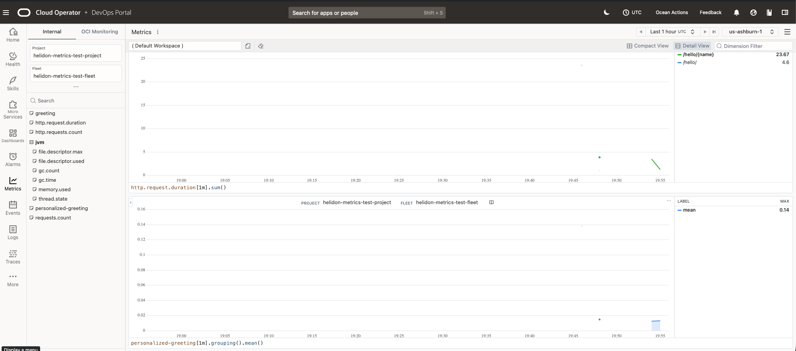

# OCI Metrics Example

## Overview

This module contains an example application which sends metrics data to the metrics backend. Because it is very difficult to reliably _read_ from the backend (permissions, time-dependent, etc.), this example does not have a test which attempts that. Instead:
0. Prerequisites - see below.
1. Build the project.
2. Start the tunnel.
3. Run the test app manually.
4Use the metrics explorer or  to verify that the metrics data is received.

## Prerequisites

Please see [How to locally test your OCI SDK Integration](../../README.md) to set up ssh tunneling for the Instance Metadata Service.

Edit the `oci-config.yaml` file to choose the local tunnel address.

## Steps

1. Build the project using `mvn clean package`.
2. Run the SSH command to open up a connection to the remote host and forward any connection on local port 8000 to the
   Instance MetaData Service endpoint (169.254.169.254:80) of the remote host. 
   ```shell
   ssh -v -L 8000:169.254.169.254:80 oci-reference-service-ad1 -t watch -n 90 date
   ```
3. Switch to a new window and run the example using 
   ```
   java -jar target/helidon-oci-examples-metrics.jar
   ```
   
4. Access the app: `curl http://localhost:8080/hello/Joe` or `curl http://localhost:8080/hello` several times.
5. View the OCI metrics console and search for project `helidon-metrics-test-project`.

The publisher region, availability domain, and fault domain are omitted from
`application.yaml`. The metrics integration defaults them from `oci-env`; this
example's `oci-config.yaml` provides a local `helidon.oci-env.location-override`
for deterministic local runs.

The OCI metrics library sends data to the back end every minute (more frequently if its internal data buffers fill before that), so expect to wait a moment for the metrics console to show observations.

You should see several metrics:
* some JVM-related ones (such as `jvm.gc.time`)
* app-specific ones such as `personalized-greeting` and `greeting` (by virtue of the annotations on the REST endpoint methods)
* per-request metrics such as `HelloService.greeting.Time`, `HelloService.greeting.ResourceTime`,
  `HelloService.greeting.WireWriteTime`, `HelloService.greeting.ResponseOut.Count`, and
  `HelloService.greeting.ResponseOut.StatusFamily.2XX.Count`.


