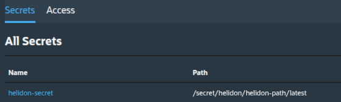

# Helidon Secret Service Example

Minimal Helidon SE example that reads a Secret Service V2 (SSv2) secret through
Helidon Config.

The endpoint reads this Helidon config key:

```text
oci.ssv2/secret/my-app/secret-path/latest
```

With the default `oci.ssv2` prefix, that key resolves to this SSv2 path:

```text
/secret/my-app/secret-path/latest
```

The value is returned from `GET /secret`.

## Prerequisite

Create the SSv2 secret `/secret/my-app/secret-path/latest` before running the
sample, and make sure the configured instance principal can read it.

The Cloud Operator Secret Service page should show an existing secret entry
before the sample is run:



## SSv2 Configuration

SSv2 bootstrap configuration lives in
[`oci-config.yaml`](src/main/resources/oci-config.yaml):

For full configuration details, see
[Secret Service Config Source](../../docs/services/secret-service.md#secret-service-config-source).

```yaml
helidon:
  oci:
    authentication-method: "instance-principal"

  oci-secret-service:
    prefix: "oci.ssv2"
    cache-ttl: "PT5M"
    poll-interval: "PT30M"
```

`oci-env` resolves the region and SSv2 endpoint domain from the OCI runtime
environment.

## Run

```shell
mvn -pl examples/secret-service -am package
java -jar examples/secret-service/target/helidon-oci-examples-secret-service.jar
curl -s http://localhost:8080/secret
```

The response body is the UTF-8 secret value returned by SSv2. This endpoint is a
sample only; do not expose a secret-echo endpoint in production services.

## Test

```shell
mvn -pl examples/secret-service -am test
```

The test uses an in-memory Helidon config value and does not require live SSv2
access.
