<!--
Mermaid diagrams are pre-rendered to SVG files under presentations/assets so
Marp PDF export embeds diagrams as images.
-->

<!-- _class: lead -->

# Announcing Helidon Talon

<div class="subtitle">
OCI's next generation framework for building OCI Native Services
</div>

## What Is Helidon Talon?

- Helidon extensions for building OCI Native Services
- A versioned BOM for consistent adoption across service teams
- Less infrastructure wiring in every application

<div class="grid-2 compact">
  <div>
    <h3>Provides</h3>
    <ul>
      <li>OCI integrations and injectable clients</li>
      <li>Environment config, auth, and observability</li>
    </ul>
  </div>
  <div>
    <h3>Targets</h3>
    <ul>
      <li>Helidon services running in OCI</li>
      <li>DP services first; stronger CP support next</li>
    </ul>
  </div>
</div>

## At a glance

<div class="center module-portfolio">



</div>

## Helidon 4 Foundation

<div class="grid-2 compact">
  <div>
    <h3>Programming model</h3>
    <ul>
      <li>Helidon SE-first services</li>
      <li>Compile-time injection via the service registry</li>
      <li>Typed configuration with generated metadata</li>
      <li>Direct service code with platform interceptors</li>
    </ul>
  </div>
  <div>
    <h3>Runtime model</h3>
    <ul>
      <li>JDK 25 baseline</li>
      <li>High-performance request handling with virtual threads</li>
      <li>Blocking code instead of async/reactive plumbing</li>
      <li>Helidon infrastructure for routing, lifecycle, config, and observability</li>
    </ul>
  </div>
</div>

## Baseline and Size

<div class="grid-3">
  <div class="metric"><strong>Helidon 4</strong><span>Target runtime, currently `4.5.0-M1`</span></div>
  <div class="metric"><strong>JDK 25</strong><span>Compiler and documented baseline</span></div>
  <div class="metric"><strong>OCI SDK 2.88.0</strong><span>Managed through dependencies</span></div>
</div>

<div class="grid-3" style="margin-top: 24px;">
  <div class="metric"><strong>28+</strong><span>Managed artifacts in the BOM</span></div>
  <div class="metric"><strong>13+</strong><span>Documented service integrations</span></div>
  <div class="metric"><strong>9+</strong><span>Runnable example applications</span></div>
</div>

## OCI Environment Config

- Discovers and publishes OCI location data
- Keeps region/domain handling out of application code
- Supports runtime discovery, dynamic core-regions metadata, IMDS fallback, and test overrides

| Value class | Examples |
|---|---|
| Region | Public OCI region, internal region name, SDK `Region` service |
| Location | Availability domain and fault domain |
| Domains | Public domain and IaaS domain for endpoint construction |
| Overrides | Local/test `location-override` values in `oci-config.yaml` |

## How `oci-env` Is Used

<div class="flow-3">
  <div class="flow-step">
    <strong>Discover</strong>
    <span>Region, AD, FD, public domain, and IaaS domain</span>
  </div>
  <div class="flow-step">
    <strong>Publish</strong>
    <span>Config keys such as <code>oci.env.region-name</code></span>
  </div>
  <div class="flow-step">
    <strong>Consume</strong>
    <span>Clients derive endpoints and SDK region services</span>
  </div>
</div>

- Keeps region and domain logic out of client integration code
- Supports runtime discovery, IMDS fallback, dynamic metadata, and test overrides
- Example: Secret Service can use `${oci.env.iaas-domain-name}`

## OCI SDK Authentication

- Shared authentication selection for OCI Java SDK clients
- Exposes the selected `BasicAuthenticationDetailsProvider`
- Auth methods are contributed by classpath modules
- Client integrations consume one provider contract

## OCI SDK Authentication Configuration

<!-- _class: small-code -->

- Config root is `helidon.oci`
- `authentication-method` selects or requires a provider
- `auto` tries available methods from the service registry
- `BasicAuthenticationDetailsProvider` can be injected

```yaml
helidon:
  oci:
    authentication-method: auto
    allowed-authentication-methods:
      - instance-principal
      - resource-principal
    region: us-ashburn-1
```

## Service Integrations

<div class="integration-map">
  <div class="integration-top">
    <div class="integration-box">Filters + Interceptors</div>
    <div class="integration-box">Injectable Clients + Config</div>
    <div class="integration-box">Declarative API + Codegen</div>
  </div>
  <div class="integration-registry">Helidon Service Registry</div>
</div>

## Audit

- Inserts a Helidon WebServer filter for OCI Audit v2 events
- Captures request path, action, request id, caller, response status, and timing
- Uses config rules to whitelist audited parameters and headers
- Emits events through the Sherlock audit logging path
- Respects `oci-splat-audited` to avoid duplicate SPLAT audit work
- Lets endpoint logic enrich the current audit event
  - `AuditPayloadAppender` is available in request scope

## Audit Configuration

- `oci.auditv2` enables auditing and names the audit source
- Rules explicitly whitelist audited request values
- A rule applies only when resource and action match

```yaml
oci:
  auditv2:
    enabled: true
    event-source: MyService
    request-parameter-rules:
      - resources: "/orders"
        actions: "POST"
        values: "orderId"
```

## Identity

- Integrates Helidon endpoints with the OCI Auth SDK
- Provides authentication, authorization, and SPLAT-aware request handling
- Registers `Principal`, `AuthorizationRequest`, and `IdentityContext` per request
- Uses annotations and built-time generated interceptors

## Identity Configuration

<!-- _class: small-code -->

- Config root is `oci.identity`
- Authentication and authorization are configured independently
- Region and location defaults can come from `oci-env`

```yaml
oci:
  identity:
    authentication:
      global-business-unit: "Cloud-Infra"
      team-name: "ExampleTeam"
      application-name: "MyService"
      use-instance-principal: true
    authorization:
      enabled: true
      service-name: "my-service"
```

## Identity Example

- Auth SDK annotations drive generated authorization interceptors
- Request data can be injected directly into resource methods

```java
@RestServer.Endpoint
@Http.Path("/orders")
class OrdersEndpoint {

    @Http.POST
    @AuthorizationPermission("ORDER_CREATE")
    String create(@Http.Entity CreateOrder request,
                  Principal principal) {
        return principal.getSubjectId();
    }
}
```

## Kiev

- Provides Helidon configuration and service registry bindings for Kiev
- Supports in-memory, direct database, and Kiev-as-a-service backends
- Exposes `DataStore`, `MappedDataStore`, and transaction support
- Adds `@KievTransaction` for declarative transaction handling

## Kiev Configuration

- Config root is `oci.kiev`
- Each entry defines one named data store
- Store names qualify injected Kiev services and transactions

```yaml
oci:
  kiev:
    data-stores:
      - backend: "IN_MEMORY"
        store-name: orders-store
        app-name: MyService
```

## Kiev Example

- Inject `MappedDataStore` by configured store name
- Open mapped buckets from service code

```java
@Service.Singleton
class OrderStore {

    @Service.Inject
    OrderStore(@Service.Named("orders-store")
               MappedDataStore dataStore) {
        var bucket = dataStore.getOrCreateBucket("orders",
                                                 String.class,
                                                 Order.class);
    }
}
```

## Kiev Transactions

<!-- _class: small-code -->

- `@KievTransaction` opens the transaction boundary around a service method
- The generated interceptor supplies a `Transaction` parameter when one is declared
- Successful write transactions commit on method exit
- Failures abort in-flight writes, then close the transaction

```java
@KievTransaction(value = "orders-store", name = "order-put")
Order put(Transaction tx, Order order) {
    return bucket.put(tx, order);
}
```

## Limits

- Provides Helidon integration for OCI Limits
- Exposes a configured Limits DP client
- Uses shared OCI SDK authentication and client configuration
- Supports endpoint and timeout configuration

## Limits Configuration

- Config root is `oci.limits`
- Client settings use the common OCI SDK timeout shape
- Endpoint can be overridden for explicit routing

```yaml
oci:
  limits:
    endpoint: https://limits.example.oraclecloud.com
    client:
      connection-timeout: PT5S
      read-timeout: PT30S
```

## Limits Example

<!-- _class: small-code limits-example -->

- Inject the configured `LimitsDPClient`
- Use it from service code to check limits and quotas

```java
@Service.Singleton
class LimitsService {
    private final LimitsDPClient limitsClient;

    @Service.Inject
    LimitsService(LimitsDPClient limitsClient) {
        this.limitsClient = limitsClient;
    }

    List<ServiceLimit> serviceLimits() {
        GetServiceLimitsRequest request = GetServiceLimitsRequest.builder()
                .group("compute")
                .tag("vm-standard")
                .build();
        return limitsClient.getServiceLimits(request).getItems();
    }
}
```

## Metering

- Reports OCI service usage through native metering libraries
- DP is high volume and must avoid per-request metering calls
  - Accumulates usage efficiently and reports emitter-dp batches
  - Uses Object Storage for durable backup
- CP is lower traffic and matches emitter-cp start/stop style
  - Supports annotations for points, timers, and metered regions
  - Uses Kiev through a `MappedDataStore` supplier

## Metering Configuration (DP)

<!-- _class: small-code -->

- Config root is `oci.metering`
- Required values come from the native emitter-dp builder
- Object Storage backup can be configured separately when enabled

```yaml
oci:
  metering:
    enabled: true
    endpoint: "https://bling.example.internal"
    metering-dir: "/var/opt/oracle/metering"
    client-id: "orders-dp"
    service: "orders"
    os-enabled: false
    k8s-based-deployment: false
```

## Metering Example (DP)

<!-- _class: metering-example -->

- DP services inject the native `LogFileUsageRecorder`
- Service code records native emitter-dp meter batches

```java
@Service.Singleton
class OrderMetering {

    private final LogFileUsageRecorder recorder;

    @Service.Inject
    OrderMetering(LogFileUsageRecorder recorder) {
        this.recorder = recorder;
    }

    void recordBatch(List<Meters> meters) throws Exception {
        recorder.recordMetersAsync(meters).call();
    }
}
```

## Metering Configuration (CP)

<!-- _class: small-code -->

- Uses metering-agent with Kiev-backed log stores
- Metered calls run inside a Kiev transaction

```yaml
oci:
  metering:
    enabled: true
    endpoint: "https://bling.example.internal"
    client-id: "orders-cp"
    region: "us-phoenix-1"
    metering-period: "PT1M"
    bucket-configs:
      - bucket-name: "orders_metering"
        service-name: "orders"
        meter-name: "orders.requests"
```

## Metering Example (CP)

<!-- _class: metering-example -->

- CP metering annotations are processed at compile time
- Parameters identify compartment, resource, amount, and tags

```java
@Metering.Point(value = "orders.created",
                tags = @Metering.Tag(key = "source", value = "api"))
void createOrder(@Metering.CompartmentId String compartmentId,
                 @Metering.ResourceId String orderId,
                 @Metering.Amount float amount,
                 @Metering.TagValue("operation") String operation) {
    // create order
}
```

## Metrics

- Publishes Helidon neutral metrics to OCI metrics
- Works with normal Helidon metrics APIs and annotations
- Supports counters, timers, distribution summaries, gauges, and functional counters
- Adds automatic HTTP request metrics and optional JVM gauges

## Metrics Configuration

- Configured as a Helidon metrics publisher of type `oci`
- Project and fleet identify the emitted metric stream
- Region can be explicit or supplied through `oci-env`
- Endpoint can be derived from OCI Monitoring or explicitly overridden

```yaml
metrics:
  publishers:
    - type: oci
      project: my-service
      fleet: my-fleet
      region: us-ashburn-1
```

## Metrics Example

- Service code uses Helidon metrics annotations
- Helidon Talon publishes metric updates to OCI metrics

```java
@Http.GET
@Http.Path("/hello/{name}")
@Metrics.Timed(value = "personalized-greeting",
               absoluteName = true)
String personalizedGreeting(@Http.PathParam("name") String name) {
    return "Hello, " + name + "!";
}
```

[object-storage-slide-001]: # "## Object Storage"
[object-storage-slide-002]: # ""
[object-storage-slide-003]: # "- Provides a service registry binding for the OCI SDK Object Storage client"
[object-storage-slide-004]: # "- Uses the shared OCI SDK authentication provider"
[object-storage-slide-005]: # "- Supports configured endpoint and region routing"
[object-storage-slide-006]: # "- Lets services inject the client instead of constructing it directly"
[object-storage-slide-007]: # ""
[object-storage-slide-008]: # "## Object Storage Configuration"
[object-storage-slide-009]: # ""
[object-storage-slide-010]: # "_class: small-code"
[object-storage-slide-011]: # ""
[object-storage-slide-012]: # "- Config root is `oci.object-storage-client`"
[object-storage-slide-013]: # "- Region derives the service endpoint when no endpoint is set"
[object-storage-slide-014]: # "- Client settings follow the common OCI SDK configuration shape"
[object-storage-slide-015]: # ""
[object-storage-slide-016]: # "```yaml"
[object-storage-slide-017]: # "oci:"
[object-storage-slide-018]: # "  object-storage-client:"
[object-storage-slide-019]: # "    region-id: us-ashburn-1"
[object-storage-slide-020]: # "    client:"
[object-storage-slide-021]: # "      connection-timeout: PT10S"
[object-storage-slide-022]: # "      read-timeout: PT1M"
[object-storage-slide-023]: # "```"
[object-storage-slide-024]: # ""
[object-storage-slide-025]: # "## Object Storage Example"
[object-storage-slide-026]: # ""
[object-storage-slide-027]: # "_class: small-code tight-pre"
[object-storage-slide-028]: # ""
[object-storage-slide-029]: # "- Inject the OCI SDK `ObjectStorage` interface"
[object-storage-slide-030]: # "- Build normal OCI SDK requests in service code"
[object-storage-slide-031]: # ""
[object-storage-slide-032]: # "```java"
[object-storage-slide-033]: # "@Service.Singleton"
[object-storage-slide-034]: # "class Buckets {"
[object-storage-slide-035]: # "    private final ObjectStorage objectStorage;"
[object-storage-slide-036]: # ""
[object-storage-slide-037]: # "    @Service.Inject"
[object-storage-slide-038]: # "    Buckets(ObjectStorage objectStorage) {"
[object-storage-slide-039]: # "        this.objectStorage = objectStorage;"
[object-storage-slide-040]: # "    }"
[object-storage-slide-041]: # ""
[object-storage-slide-042]: # "    void listBuckets(String namespace, String compartmentId) {"
[object-storage-slide-043]: # "        objectStorage.listBuckets(ListBucketsRequest.builder()"
[object-storage-slide-044]: # "                .namespaceName(namespace)"
[object-storage-slide-045]: # "                .compartmentId(compartmentId)"
[object-storage-slide-046]: # "                .build());"
[object-storage-slide-047]: # "    }"
[object-storage-slide-048]: # "}"
[object-storage-slide-049]: # "```"

## Secret Service V2

- Exposes Secret Service V2 values through Helidon Config
- Provides server and client mTLS material

<div class="ssv2-pair">
  <div class="ssv2-box">Config Secrets</div>
  <div class="ssv2-plus">+</div>
  <div class="ssv2-box mtls">mTLS Rotation</div>
</div>

## Secret Service V2 Secrets

- Exposes Secret Service V2 values through Helidon Config
- Maps a configured key prefix to SSv2 secret paths
- Resolves secrets lazily when application code reads the key
- Caches direct reads and polls only previously requested keys
- Can derive endpoints from environment configuration

## Secret Service V2 Secrets Configuration

- Configured under `helidon.oci-secret-service`
- Prefix maps config lookups to Secret Service paths
- Endpoint can use `${oci.env.iaas-domain-name}`

```yaml
helidon:
  oci-secret-service:
    prefix: "oci.ssv2"
    cache-ttl: "PT5M"
    client:
      endpoint: "https://secret-service-ce.${oci.env.iaas-domain-name}/v1"
```

## Secret Service V2 Secrets Example

<!-- _class: small-code -->

- Inject Helidon `Config`
- Read SSv2-backed values using the configured prefix

```java
@Service.Singleton
final class SecretAwareService {
    private final String password;

    @Service.Inject
    SecretAwareService(Config config) {
        this.password = config.get("oci.ssv2/secret/orders/db/latest")
                .asString()
                .orElseThrow();
    }
}
```

## Secret Service V2 mTLS

- Provides the `oci-ssv2` TLS manager
- Loads PKI JSON material from SSv2 or a Helidon resource
- Rotates server and client mTLS material on a reload schedule
- Supports Helidon clients and raw `SSLContext` use

## Secret Service V2 mTLS Rotation

<!-- _class: small-code tight-pre -->

- Select `oci-ssv2` under Helidon TLS manager config
- `pki.secret-path` points to PKI JSON material in SSv2
- `reload.expression` controls the refresh cadence
- The same manager shape works for server and client TLS

```yaml
server:
  tls:
    client-auth: "REQUIRED"
    manager:
      oci-ssv2:
        reload.expression: "0 0/30 * * * ? *"
        pki.secret-path: "/secret/orders/mtls/server/latest"
        trust.path: "/etc/oci-pki/ca-bundle.pem"
```

## Splat

- Adds SPLAT mTLS validation support for Helidon endpoints
- Bridges SPLAT-authenticated requests into Helidon request handling
- Supports OCI service front-door integration patterns
- Works with Identity for SPLAT-aware authentication flows

## Splat Configuration

- Config root is `oci.splat`
- Validation runs on generated endpoint handlers
- Region can be explicit or resolved from the OCI environment

```yaml
oci:
  splat:
    enabled: true
    reject-x-region-calls: false
    region: us-ashburn-1
```

## Tagging

- Contributes the internal tagging client to the Helidon service registry
- Converts tag sets to and from persisted tag slugs
- Supports freeform, defined, and system tags
- Helps connect resource write paths with authorization flows

## Tagging Configuration

- Config root is `oci.tagging`
- Client is available from the Helidon service registry
- Metrics emission can be enabled or disabled

```yaml
oci:
  tagging:
    emit-metrics: false
```

## Tagging Example

<!-- _class: small-code tight-pre extra-small-code -->

- Inject `TaggingClient` from the service registry
- Convert request tags into a persisted tag slug

```java
@Service.Singleton
class TagService {
    private final TaggingClient taggingClient;

    @Service.Inject
    TagService(TaggingClient taggingClient) {
        this.taggingClient = taggingClient;
    }

    byte[] slug(Map<String, String> tags) {
        TagSet tagSet = TagSet.builder()
                .freeformTags(FreeformTags.builder()
                                  .tags(tags)
                                  .build())
                .build();
        return taggingClient.toByteArray(tagSet);
    }
}
```

## Workflow

- Integrates OCI Workflow-as-a-Service with Helidon Talon services
- Inject the native WFaaS `WorkflowClient` directly
- Use worker and poller clients through Helidon service registry names
- Configure endpoint, domain, timeouts, retry policy, and worker identity

## Workflow Configuration

- Config root is `oci.workflow`
- Endpoint settings configure WFaaS routing and timeouts
- Worker and poller clients are exposed through service registry names

```yaml
oci:
  workflow:
    domain-id: compute-control-plane
    endpoint-details:
      server-endpoint: https://wfaas.example.internal
      connect-timeout: PT5S
    worker-identifier: my-service-worker
```

## Workflow Example

<!-- _class: small-code extra-small-code workflow-example -->

- Inject default worker `WorkflowClient`
- Serialize JSON request with Helidon `JsonBinding`

```java
@Service.Singleton
class ProvisioningWorkflowService {
    private static final JsonBinding JSON = JsonBinding.create();
    private final WorkflowClient workflowClient;

    @Service.Inject
    ProvisioningWorkflowService(WorkflowClient workflowClient) {
        this.workflowClient = workflowClient;
    }

    WorkflowInstance launch(LaunchWorkflowRequest json) {
        byte[] payload = JSON.serialize(json).getBytes(StandardCharsets.UTF_8);
        LaunchWorkflowArguments request = LaunchWorkflowArguments.builder()
                .workflowDefinitionId(WorkflowDefinitionId.builder()
                                                          .name("instance-create")
                                                          .build())
                .workflowArguments(payload)
                .build();
        return workflowClient.launchWorkflow(request);
    }
}
```

## Integrated Client Versions

<div class="versions versions-grid">

<div>

| Client library | Managed version |
|---|---:|
| OCI Java SDK | `2.88.0` |
| Identity Auth SDK | `3.1.336` |
| Kiev | `2.0.35` |
| Limits DP Java Client | `1.9` |
| Metrics module | `2.0.12` |
| Metrics library | `1.1.30` |

</div>

<div>

| Client library | Managed version |
|---|---:|
| Workflow / WFaaS | `14.0.0` |
| Metering DP emitter | `1.0.0.9` |
| Metering CP agent | `11.0.0.68` |
| SPLAT SDK | `0.1.39635` |
| Tagging | `4.3.5` |
| Vault user Java client | `1.0.8` |

</div>

</div>

## Heliport

- Migrates Dropwizard apps to Helidon Talon apps
- Combines OpenRewrite recipes with Codex-guided planning and validation
- Produces a migrated tree, `.heliport/` report, action plan, and proof evidence
- Still improving and can benefit from a Codex analysis after migration

<div class="center heliport-flow">


</div>

## Data Plane Reference App

- Runnable Helidon Talon reference service under `examples/data-plane`
- Combines request ID, OCI error responses, Identity, Kiev, and Audit
- Demonstrates signed robot create/update/delete APIs with `@AuthorizationPermission`
- Uses in-memory Kiev by default so teams can run and test without external infrastructure

## What Teams Should Take Away

- Consider Heliport + Codex for Dropwizard-to-Helidon migration work
- Consult the Data Plane Reference App before wiring a new DP service
- Let `helidon-oci-envconfig` resolve region, AD, FD, and domains
- Add only the Helidon Talon integrations your service needs
- Stay tuned for additional features and integrations in upcoming releases!

## Resources

- User's Channel: `#helidon-users`
- Documentation: `https://helidon.oraclecorp.com/docs/2.0.0-RC1/`
- Repository: `https://devops.oci.oraclecorp.com/devops-coderepository/namespaces/axuxirvibvvo/projects/HLDN/repositories/oci-helidon`
- Heliport: `https://devops.oci.oraclecorp.com/devops-coderepository/namespaces/axuxirvibvvo/projects/HLDN/repositories/heliport`
